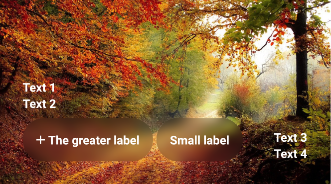
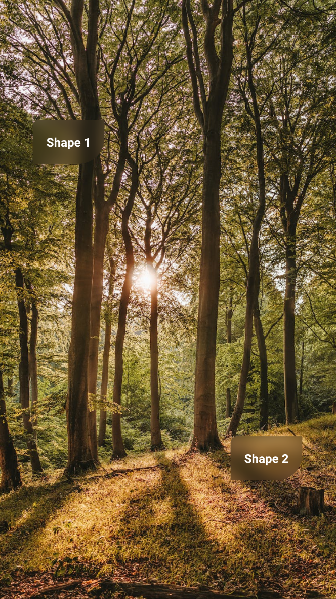
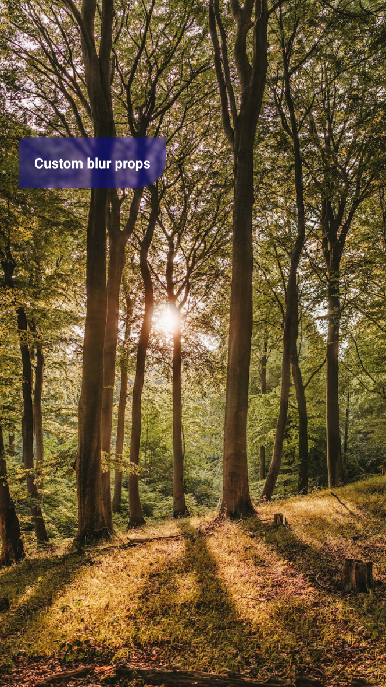

This is [**React Native**](https://reactnative.dev) project, bootstrapped using [`@react-native-community/cli`](https://github.com/react-native-community/cli).

The project only aims to exemplify how to blur elements in a performant and creative way over images with bare React Native code. (some code updates coming soon)

If you require new features or bug fixes you can fork this project, but consider starring this repository and mention the credits.

The idea/concept behind this implementation is explained in my [Medium profile](https://ggraeff.medium.com/a-creative-and-performant-way-of-blur-elements-views-in-react-native-ios-android-42e6aea98654).

Some usage examples (heavy file can take seconds to load):

#### Only ImageBlurView will be blurred


#### Full width blur


#### Full height blur


#### Full width / height blur


#### Multiple ImageBlurView



#### Multiple blur shapes



#### Custom blur props (blurRadius and overlay)



# Getting Started

> **Note**: Make sure you have completed the [React Native - Environment Setup](https://reactnative.dev/docs/environment-setup) instructions till "Creating a new application" step, before proceeding.

## Step 1: Start the Metro Server

First, you will need to start **Metro**, the JavaScript _bundler_ that ships _with_ React Native.

To start Metro, run the following command from the _root_ of your React Native project:

```bash
yarn start
```

## Step 2: Start your Application

You can start the application by running:

```bash
# Metro Server
yarn start

# Android
yarn android

# iOS
yarn ios
```

[Android performance test with Expo Go + Storybook](docs/AndroidPerformance.md)
