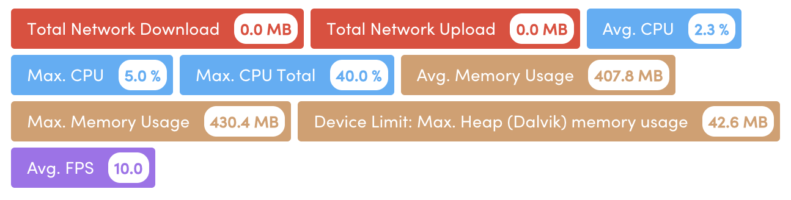

# The performance tests below were done in an Expo Go repo with Storybook, the most performance spikes are related to open, and closing the app and the results are terrific. So stay tunned to the next round of tests in a bare React native repo.

## **What are Mobile Performance Thresholds?**

When you run a test with Apptim Desktop and generate a performance report of your app, you will see certain colors (red/yellow/green/gray) in each metrics captured by Apptim.

In the main dashboard cards (top) and in the _Summary_ section, you see that each metric is evaluated against default thresholds set in Apptim, which are based on Google’s best practices (Android) and Apple’s best practices (iOS), along with other market benchmarks that consider device fragmentation. Each of these will have a color according to the result against after applying the thresholds. We call these thresholds _Low_, _Moderate_ or _Warning Limit_.

- **Moderate Limit:** when the metric value is over a "recommended" threshold that might cause issues in some devices, you will see a **yellow mark**. 🟡
- **Warning Limit**: when the metric value is over an "acceptable" threshold and is likely to cause issues on some devices, you will see a **red mark**. 🔴
- **Low Limit:** when the metric value is in the range of the default threshold, you will see a **green mark.** 🟢
- **Skipped:** when a metric is **not defined** in the threshold file, it will not be compared with any threshold and you will see it in grey under the **skipped list**. \*\*\*\*⚪️

Check the tables below to see what the current **default thresholds** are for Android and iOS apps.

# **Default Thresholds for Android apps**

## **Device Performance**

| Metric category                           | Moderate Limit 🟡 | Warning Limit 🔴 |
| ----------------------------------------- | ----------------- | ---------------- |
| Avg. CPU usage                            | 20%               | 50%              |
| Max. CPU usage                            | 70%               | 90%              |
| Avg. Memory usage                         | 256 MB            | 384 MB           |
| Max. Memory usage                         | 384 MB            | 512 MB           |
| Avg./Max. Dalvik usage (market limit)     | 64 MB             | 128 MB           |
| Max. Dalvik usage (device limit)          | 80%               | 90%              |
| Max. Dalvik usage after GC (device limit) | 60%               | 80%              |
| Network: Uploaded data                    | 5000 KB           | 20000 KB         |
| Network: Downloaded data                  | 20000 KB          | 50000 KB         |
| Storage Used                              | 100 MB            | 200 MB           |
| Power Usage                               | 33%               | 66%              |

## **App Performance**

| Metric category                 | Moderate Limit 🟡 | Warning Limit 🔴 |
| ------------------------------- | ----------------- | ---------------- |
| Avg. FPS                        | 30 FPS            | 15 FPS           |
| Max. Drawing time               | 160 ms            | 320 ms           |
| Max. lag in render frame (jank) | 2 frames          | 3 frames         |

## **App Correctness**

| Metric category                    | Moderate Limit 🟡 | Warning Limit 🔴 |
| ---------------------------------- | ----------------- | ---------------- |
| # Android Activities               | 50                | 500              |
| # Android Activities on Back Stack | 6                 | 10               |
| Max. controls on the screen        | 50                | 100              |
| # Nested layouts                   | 10                | 20               |

# **Default Thresholds for iOS apps**

## **Device Performance**

| Metric category          | Moderate Limit 🟡 | Warning Limit 🔴 |
| ------------------------ | ----------------- | ---------------- |
| Avg. CPU Usage           | 20%               | 50%              |
| Max. CPU Usage           | 70%               | 90%              |
| Avg. Memory Usage        | 256 MB            | 384 MB           |
| Max. Memory Usage        | 384 MB            | 512 MB           |
| Network: Uploaded data   | 5000 KB           | 20000 KB         |
| Network: Downloaded data | 20000 KB          | 50000 KB         |
| Storage Used             | 100 MB            | 200 MB           |
| Power Usage              | 33%               | 66%              |

## **App Performance**

| Metric category | Moderate Limit 🟡 | Warning Limit 🔴 |
| --------------- | ----------------- | ---------------- |
| Avg. FPS        | 30 FPS            | 15 FPS           |

## **App Correctness**

| Metric category             | Moderate Limit 🟡 | Warning Limit 🔴 |
| --------------------------- | ----------------- | ---------------- |
| Max. controls on the screen | 50                | 100              |
| # Nested Layouts            | 10                | 20               |

---

# Performance Tests on Android using Apptim

## Blurred Components

### _Multiple Blurred Elements story_

Problems encountered (but possibly related to Storybook only):

- When putting Expo Go in the background, there is a single spike of low rendering, but still within an acceptable range - with an average FPS values slightly above the recommended level.

- When closing and reopening Expo Go, there is a spike in memory usage above the recommended level.

  

  For this particular test, these are the total alert values when testing the Blur scenario on multiple pages:

  - Avg. FPS 10 (recommended is 6)
  - Avg. Memory Usage of 407.8 MB (recommended to be below 384 MB)

  

  

  ***

  ### “_Multiple Blurs in a Single Element” story_

  

  Unlike the `MultipleBlurred Elements` Story, the `Multiple blurs in a single element` one registered a crash, which was invisible to the user.

  

  Spikes in Network, CPU, Memory, and Rendering were found when closing/reopening Storybook, with the rendering spike values in the summary being higher in the scenario of multiple blur points in the same image compared to having multiple images with a single blur point each.

  

  

  

— Average FPS of 5.7, whereas in the `multiple image element` story the result was 2.2.

---

### “_Blur with children” story_

This story didn't present any significant highlight in the analysis of individual graphics - the low rendering values were observed when closing/reopening the Storybook, which are not related to the component itself but to the platform being used for testing. That being said, there are no performance issues in this case.

All points considered, none of the scenarios above has hindered the user experience with the Blur component on Android - the device temperature maintained its normal state, no lagging was observed nor was there a visible crash. The final recommendation, though, is to have a single blur element (ref. `Multiple blurred elements` or `Blur with children` stories*)* per image to avoid considerable spikes that can be interpreted as low-performance values.

All credits for testing and documenting for [Patricia Santos](https://www.linkedin.com/in/patricia-csantos/)
